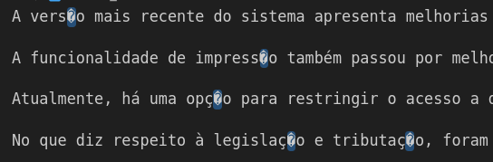
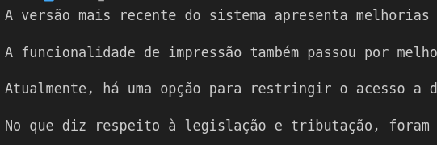

# conserta-acentos

## O que esse programa faz ?
O intuito é susbstituir os caracteres defeituosos `�` que geralmente são gerados durante
problemas com merge, editores de texto com codificação diferente e etc.

## Exemplo
### Entrada

### Saída

## Modo de uso
1. Copie o conteúdo do arquivo para o arquivo _src/assests/rotten_file.txt_.
2. Execute o comando `npm start`.
3. O arquivo consertado ficará disponível em _/output/fixed_file.txt_.